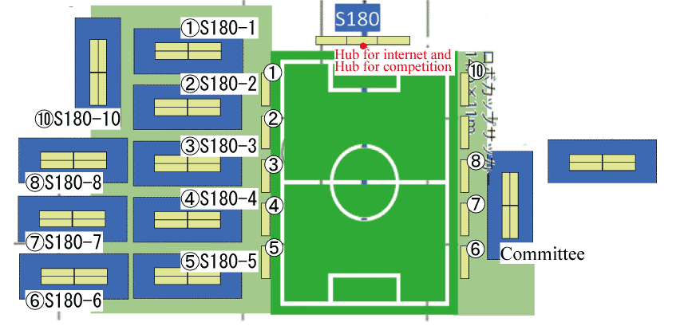

このページでは、JapanOpen2024の小型リーグに関する情報を発信しています。

大会の概要は [大会公式ホームページ](https://www.robocup.or.jp/JapanOpen2024/)をご確認ください。

参加希望のチームは[参加登録方法]({{site.baseurl}})を確認し、チーム番号発行用フォームへの記入をお願いします。

# 参加チーム
## 車輪型

|チームコード|所属|チーム名|
|---|---|---|
|S180-1|豊田工業高等専門学校|KIKS|
|S180-2|Roots|Roots|
|S180-3|Zhejiang University|ZJUNlict|
|S180-4|なし|ibis|
|S180-5|立命館大学|Ri-one|
|S180-6|仙台高専広瀬キャンパス|Sasa-kamatti|
|S180-7|Ningbo University of Technology|Compilation Error|
|S180-8|愛知県立大学|RoboDragons|
|S180-9|Shenzhen Technology University|1034Robotics|
|S180-10|なし|GreenTea|

## ヒト型

|チームコード|所属|チーム名|
|---|---|---|
|S180H-1|大阪電気通信大学|ODENS|
|S180H-2|愛知県立愛知総合工科高等学校専攻科|TEAC|

# ルール
競技は基本的に Div.A ルールで行われます。  
使用するルールのバージョンは確定次第お知らせします。

# 会場の詳細
{: align=right width=30%}

# スケジュール
## 4/27 (Sat)
| Time  | Match Number | Team1 (Wireless ch) | Team2 (Wireless ch)      | Refree & GameController | Assistant Ref. & Vision Expert | 
| ----- | ------------ |:----------------------:|:---------------------------:|:--------------------------:|:---------------------------------:| 
| 10:00 | SSL-1 A-1 | ZJUNlict (ch36)     | ibis (ch40)              | RoboDragons                | KIKS                              | 
| 11:00 | SSL-2 B-1 | Sasa-kamatti (ch36) | Roots (ch40)             | Compilation Error          | ibis                              | 
| 12:00 | SSL-3 A-2 | Ri-one (ch36)       | GreenTea (ch40)          | Roots                      | ZJUNlict                          | 
| 13:00 | SSL-4 B-2 | KIKS (ch36)         | RoboDragons (ch40)       | ibis                       | Ri-one                            | 
| 14:00 | SSL-5 A-3 | ZJUNlict (ch36)     | Compilation Error (ch40) | Sasa-kamatti               | KIKS                              | 
| 15:00 | SSL-6 A-4 | ibis (ch36)         | GreenTea (ch40)          | RoboDragons                | Roots                             | 
| 16:00 | SSL-7 B-3 | Sasa-kamatti (ch36) | KIKS (ch40)              | ZJUNlict                   | Ri-one                            | 
| 17:00 | SSL-8 A-5 | GreenTea (ch36)     | Compilation Error (ch40) | Roots                      | Sasa-kamatti                      | 
| 18:00 | SSL-9 A-6 | ibis (ch36)         | Ri-one (ch40)            | KIKS                       | Compilation Error                 | 

## 4/28 (Sun)
| Time  | Match Number   | Team1 (Wireless ch) | Team2 (Wireless ch)      | Refree & GameController | Assistant Ref. & Vision Expert | 
| ----- | -------------- | ---------------------- | --------------------------- | -------------------------- | --------------------------------- | 
| 10:00 | SSL-10 A-7  | ZJUNlict (ch36)     | Ri-one (ch40)            | Sasa-kamatti               | Compilation Error                 | 
| 11:00 | SSL-11 B-4  | Roots (ch36)        | RoboDragons (ch40)       | GreenTea                   | Ri-one                            | 
| 12:00 | SSL-12 A-8  | ibis (ch36)         | Compilation Error (ch40) | KIKS                       | ZJUNlict                          | 
| 13:00 | SSL-13 B-5  | Sasa-kamatti (ch36) | RoboDragons (ch40)       | Ri-one                     | ibis                              | 
| 14:00 | SSL-14 A-9  | ZJUNlict (ch36)     | GreenTea (ch40)          | Sasa-kamatti               | Compilation Error                 | 
| 15:00 | SSL-15 B-6  | Roots (ch36)        | KIKS (ch40)              | ibis                       | GreenTea                          | 
| 16:00 | SSL-16 A-10 | Ri-one (ch36)       | Compilation Error (ch40) | RoboDragons                | GreenTea                          | 
| 17:00 | SSL-17 FT-1 | League A 1st (ch36) | League B 2nd (ch40)      | Ri-one                     | Roots                             | 
| 18:00 | SSL-18 FT-2 | League B 1st (ch36) | League A 2nd (ch40)      | Sasa-kamatti               | GreenTea                          | 

## 4/29 (Mon)
| Time  | Match Number             | Team1 (Wireless ch)| Team2 (Wireless ch)| Refree & GameController | Assistant Ref. & Vision Expert | 
| ----- | ------------------------ | --------------------- | --------------------- | -------------------------- | --------------------------------- | 
| 9:30  | SSL-19 3rd Place Game | FT-1Loser (ch36)   | FT-2Loser (ch40)   | ibis                       | Ri-one                            | 
| 11:00 | SSL-20 Final Game     | FT-1Winner (ch36)  | FT-2Winner (ch40)  | Roots                      | Sasa-kamatti                      | 
