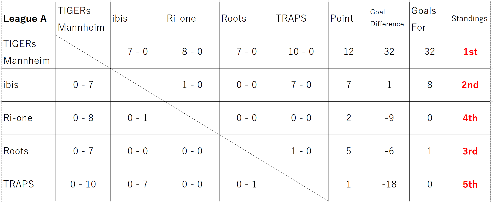
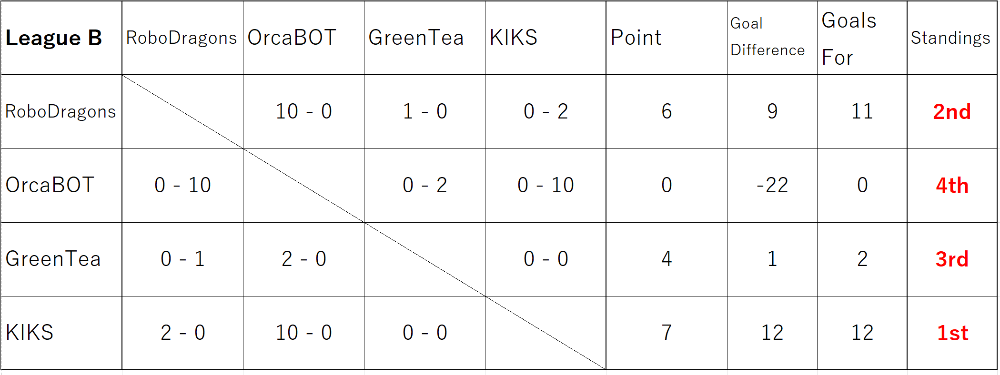

---
title: "Japan Open 2025"
layout: single
toc: true
--- 

このページでは、JapanOpen2025の小型リーグに関する情報を発信しています。

大会の概要は [大会公式ホームページ](https://www.robocup.or.jp/JapanOpen2025/)をご確認ください。

参加希望のチームは[参加登録方法]({{site.baseurl}})を確認し、チーム番号発行用フォームへの記入をお願いします。

# 参加チーム
## 車輪型

|チームコード|所属|チーム名|
|---|---|---|
|S180-1|豊田工業高等専門学校|KIKS|
|S180-2|DHBW Mannheim|TIGERs Mannheim|
|S180-3|なし|Roots|
|S180-4|なし|ibis|
|S180-5|愛知県立大学|RoboDragons|
|S180-6|立命館大学|Ri-one|
|S180-7|なし|GreenTea|
|S180-8|SIIT, Thammasatd|OrcaBOT|
|S180-9|なし|TRAPS|

## ヒト型チャレンジ

|チームコード|所属|チーム名|
|---|---|---|
|S180H-1|大阪電気通信大学|ODENS|
|S180H-2|富山県立大学|kagayaki|

# ルール
競技は基本的に Div.A ルールで行われます。  
使用するルールのバージョンは確定次第お知らせします。

# 会場の詳細
TBA
{: align=right width=30%}

# スケジュール
## 5/3 (Sat)

| Time  | Match Number | Team1 (Wireless ch)   | Team2 (Wireless ch)      | Refree & GameController | Assistant Ref. & Vision Expert | 
| ----- | ------------ |:------------------------:|:---------------------------:|:--------------------------:|:---------------------------------:| 
| 11:30 | SSL-1 A-1 | TIGERs Mannheim (ch36)| ibis (ch40)              | KIKS                       | GreenTea                          | 
| 12:30 | SSL-2 B-1 | RoboDragons (ch36)    | OrcaBOT (ch40)           | TRAPS                      | ibis                              | 
| 13:30 | SSL-3 A-2 | Ri-one (ch36)         | Roots (ch40)             | OrcaBOT                    | TIGERs Mannheim                   | 
| 14:30 | SSL-4 B-2 | GreenTea (ch36)       | KIKS (ch40)              | ibis                       | Ri-one                            | 
| 15:30 | SSL-5 A-3 | TIGERs Mannheim (ch36)| TRAPS (ch40)             | RoboDragons                | GreenTea                          | 
| 16:30 | SSL-6 A-4 | ibis (ch36)           | Roots (ch40)             | KIKS                       | OrcaBOT                           | 
| 17:30 | SSL-7 B-3 | RoboDragons (ch36)    | GreenTea (ch40)          | TIGERs Mannhe              | Ri-one                            | 
| 18:30 | SSL-9 A-6 | ibis (ch36)           | Ri-one (ch40)            | GreenTea                   | TRAPS                             | 

## 5/4 (Sun)

| Time  | Match Number   | Team1 (Wireless ch)   | Team2 (Wireless ch)      | Refree & GameController | Assistant Ref. & Vision Expert | 
| ----- | -------------- |:------------------------:|:---------------------------:|:--------------------------:|:---------------------------------:| 
| 09:00 | SSL-8 A-5 | Roots (ch36)          | TRAPS (ch40)             | OrcaBOT                    | RoboDragons                       | 
| 10:00 | SSL-10 A-7  | TIGERs Mannheim (ch36)| Ri-one (ch40)            | RoboDragons                | TRAPS                             | 
| 11:00 | SSL-11 B-4  | OrcaBOT (ch36)        | KIKS (ch40)              | Roots                      | Ri-one                            | 
| 12:00 | SSL-12 A-8  | ibis (ch36)           | TRAPS (ch40)             | GreenTea                   | TIGERs Mannheim                   | 
| 13:00 | SSL-13 B-5  | RoboDragons (ch36)    | KIKS (ch40)              | Ri-one                     | ibis                              | 
| 14:00 | SSL-14 A-9  | TIGERs Mannheim (ch36)| Roots (ch40)             | RoboDragons                | TRAPS                             | 
| 15:00 | SSL-15 B-6  | OrcaBOT (ch36)        | GreenTea (ch40)          | ibis                       | Roots                             | 
| 16:00 | SSL-16 A-10 | Ri-one (ch36)         | TRAPS (ch40)             | KIKS                       | Roots                             | 
| 17:00 | SSL-17 FT-1 | TIGERs Mannheim (ch36)| RoboDragons (ch40)       |League A 5th                | GreenTea                          | 
| 18:00 | SSL-18 FT-2 | KIKS (ch36)           |ibis (ch40)               | OrcaBOT                    | League A 4th                      | 

## 5/5 (Mon)

| Time  | Match Number             | Team1 (Wireless ch)| Team2 (Wireless ch)| Refree & GameController | Assistant Ref. & Vision Expert | 
| ----- | ------------------------ | --------------------- | --------------------- | -------------------------- | --------------------------------- | 
| 9:30  | SSL-19 3rd Place Game | FT-1Loser (ch36)   | FT-2Loser (ch40)   | ibis                         | Ri-one                                | 
| 11:00 | SSL-20 Final Game     | FT-1Winner (ch36)  | FT-2Winner (ch40)  | OrcaBOT                         | RoboDragons                                | 

# ライブ配信
[1日目(5/3)](https://youtube.com/live/tPviN8eeQGY?feature=share)

[2日目(5/4)](https://youtube.com/live/zSQ9-xXMb54?feature=share)

[3日目(5/5)](https://youtube.com/live/q61zFJ8qjLg?feature=share)

# 結果
[PDF版](pdf/ssl_matches_2025_results.pdf)

## 予選リーグ
### リーグA
{: align=right width=30%}

### リーグB
{: align=right width=30%}

## 決勝トーナメント
{: align=right width=30%}

## 3位決定戦
{: align=right width=30%}

