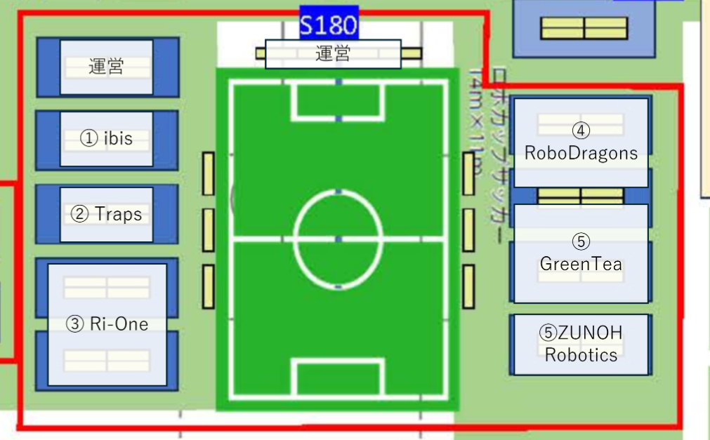

---
title: "Japan Open 2026"
layout: single
toc: true
--- 

このページでは、JapanOpen2026の小型リーグに関する情報を発信しています。

大会の概要は [大会公式ホームページ](https://www.robocup.or.jp/JapanOpen2026/)をご確認ください。

参加希望のチームは[参加登録方法]({{site.baseurl}})を確認し、チーム番号発行用フォームへの記入をお願いします。

[ヒト型チャレンジ（SSL Humanoid）については、こちらで発信しています。]({{site.baseurl}})

# 現在の試合状況
<iframe src="https://ssl.robocup.jp/vision/" style="width: 100%; height: 600px; border: none; margin-bottom: 20px;"></iframe>

<iframe src="https://ssl.robocup.jp/statusboard/" style="width: 100%; height: 600px; border: none; margin-bottom: 20px;"></iframe>

# 参加チーム
## 車輪型

TDP (Team Description Paper) とは、各チームがロボットのハードウェア・ソフトウェア・戦略などについて記述した技術資料です。

|チームコード|所属|チーム名|TDP|
|---|---|---|---|
|S180-1|ibis|ibis|[TDP](https://ssl.robocup.org/wp-content/uploads/2026/04/2026_ETDP_ibis.pdf)|
|S180-2|Traps|TRAPS|[TDP](https://ssl.robocup.org/wp-content/uploads/2026/03/2026_TDP_TRAPS.pdf)|
|S180-3|立命館大学|Ri-one|[TDP](https://ssl.robocup.org/wp-content/uploads/2026/03/2026_ETDP_Ri-one.pdf)|
|S180-4|愛知県立大学|RoboDragons|[TDP](https://ssl.robocup.org/wp-content/uploads/2026/04/2026_ETDP_RoboDragons.pdf)|
|S180-5|なし|GreenTea|[TDP](https://ssl.robocup.org/wp-content/uploads/2026/03/2026_TDP_GreenTea.pdf)|
|S180-6|個人|ZUNOH Robotics|-|

## ヒト型チャレンジ

|チームコード|所属|チーム名|
|---|---|---|
|S180H-2|大阪電気通信大学|ODENS|
|S180H-3|社会人有志チーム（BackSpace）|BackSpace|

# ルール
競技は基本的に Div.A ルールで行われます。  
使用するルールのバージョンは確定次第お知らせします。

競技マニュアルは[こちら](https://docs.google.com/document/d/1dwrn9Yr_kU_WlADX9K2rdUb8diAqX2Cm/edit#heading=h.c55hm6v49qix)をご確認ください。

# 会場の詳細
{: align=right width=30%}

# スケジュール

## 4/24 (Fri) セットアップ日

| Time  | 内容 |
| ----- | ---- |
| 8:30  | 開場 |
| 13:00頃〜 | Vision セットアップ開始 |
| 13:00頃〜 | 随時車検 |
| 17:00 | リーダー MTG（対戦割当のくじ引き） |
| 19:30 | 完全撤収 |

## 4/25 (Sat) 大会1日目

| Time  | Match Number | Team1 (Wireless ch) | Team2 (Wireless ch) | Refree & GameController | Assistant Ref. & Vision Expert & 配信・解説 |
| ----- | ------------ |:----------------------:|:----------------------:|:--------------------------:|:-------------------------------------------------:|
| 8:30  | 開場          |                        |                        |                            |                                                   |
| 9:00  | リーダー MTG  |                        |                        |                            |                                                   |
| 9:30  | 開会式        |                        |                        |                            |                                                   |
| 10:00 | 各チーム調整時間 / Vision セットアップ | | |              |                                                   |
| 11:00-11:45 | SSL-1 リーグ第1試合 | ibis (ch36)     | ZUNOH (ch40)     | Ri-ONE     | RoboDragons |
| 12:00-12:45 | SSL-2 リーグ第2試合 | GreenTea (ch44) | TRAPS (ch48)     | ibis       | ZUNOH       |
| 13:00-13:45 | SSL-3 リーグ第3試合 | ibis (ch36)     | Ri-ONE (ch40)    | RoboDragons | ZUNOH      |
| 14:00-14:45 | SSL-4 リーグ第4試合 | Ri-ONE (ch44)   | RoboDragons (ch48) | TRAPS    | ibis        |
| 15:00-15:45 | SSL-5 リーグ第5試合 | ibis (ch36)     | GreenTea (ch40)  | Ri-ONE     | ZUNOH       |
| 16:00-16:45 | SSL-6 リーグ第6試合 | ZUNOH (ch44)    | TRAPS (ch48)     | GreenTea   | Ri-ONE      |
| 17:00-17:45 | SSL-7 リーグ第7試合 | ibis (ch36)     | RoboDragons (ch40) | ZUNOH    | TRAPS       |
| 18:00-18:45 | SSL-8 リーグ第8試合 | ZUNOH (ch44)    | GreenTea (ch48)  | RoboDragons | ibis       |
| 19:30 | 完全撤収      |                        |                        |                            |                                                   |

## 4/26 (Sun) 大会2日目

| Time  | Match Number | Team1 (Wireless ch) | Team2 (Wireless ch) | Refree & GameController | Assistant Ref. & Vision Expert & 配信・解説 |
| ----- | ------------ |:----------------------:|:----------------------:|:--------------------------:|:-------------------------------------------------:|
| 8:30  | 開場          |                        |                        |                            |                                                   |
| 9:00  | リーダー MTG  |                        |                        |                            |                                                   |
| 9:45-10:30  | SSL-9 リーグ第9試合   | ibis (ch36)     | TRAPS (ch40)       | Ri-ONE      | GreenTea    |
| 10:45-11:30 | SSL-10 リーグ第10試合 | ZUNOH (ch44)    | Ri-ONE (ch48)      | ibis        | TRAPS       |
| 11:45-12:30 | SSL-11 リーグ第11試合 | GreenTea (ch36) | RoboDragons (ch40) | ZUNOH       | TRAPS       |
| 12:45-13:30 | SSL-12 リーグ第12試合 | TRAPS (ch44)    | Ri-ONE (ch48)      | RoboDragons | GreenTea    |
| 13:45-14:30 | SSL-13 リーグ第13試合 | ZUNOH (ch36)    | RoboDragons (ch40) | Ri-ONE      | ibis        |
| 14:45-15:30 | SSL-14 リーグ第14試合 | GreenTea (ch44) | Ri-ONE (ch48)      | TRAPS       | RoboDragons |
| 15:45-16:30 | SSL-15 リーグ第15試合 | TRAPS (ch36)    | RoboDragons (ch40) | GreenTea    | ibis        |
| 16:45-17:45 | SSL-16 FT-1           | リーグ1位 (ch44) | リーグ4位 (ch48)  | リーグ5位チーム | リーグ6位チーム |
| 18:00-19:00 | SSL-17 FT-2           | リーグ3位 (ch36) | リーグ2位 (ch40)  | SSL-16 Aチーム | SSL-16 Bチーム |
| 19:30 | 完全撤収      |                        |                        |                            |                                                   |

## 4/27 (Mon) 大会3日目

| Time  | Match Number | Team1 (Wireless ch) | Team2 (Wireless ch) | Refree & GameController | Assistant Ref. & Vision Expert & 配信・解説 |
| ----- | ------------ |:----------------------:|:----------------------:|:--------------------------:|:-------------------------------------------------:|
| 8:30  | 開場          |                        |                        |                            |                                                   |
| 9:00  | リーダー MTG  |                        |                        |                            |                                                   |
| 10:30-11:30 | SSL-18 3rd Place Game |  (ch36) |  (ch40) | リーグ6位チーム | リーグ5位チーム |
| 12:00-13:00 | SSL-19 Final Game     |  (ch44) |  (ch48) | SSL-18 Aチーム | SSL-18 Bチーム |
| 14:30 | SSL 表彰式   |                        |                        |                            |                                                   |
| 15:00 | 閉会式        |                        |                        |                            |                                                   |
| 19:30 | 完全撤収      |                        |                        |                            |                                                   |

# ライブ配信
TBA

# 結果

## 予選リーグ

| League | ibis | ZUNOH | GreenTea | TRAPS | Ri-ONE | RoboDragons | Point | Goal Difference | Goals For | Standings |
|:------:|:----:|:-----:|:--------:|:-----:|:------:|:-----------:|:-----:|:---------------:|:---------:|:---------:|
| ibis        |  -  | 6-0 | 4-0    |        | 3-0 | 1-1 |  |  |  |  |
| ZUNOH       | 0-6 |  -  | 2-0    | 1-8    |     |     |  |  |  |  |
| GreenTea    | 0-4 | 0-2 |   -    | 0-0 負 |     |     |  |  |  |  |
| TRAPS       |     | 8-1 | 0-0 勝 |   -    |     |     |  |  |  |  |
| Ri-ONE      | 0-3 |     |        |        |  -  | 0-2 |  |  |  |  |
| RoboDragons | 1-1 |     |        |        | 2-0 |  -  |  |  |  |  |
