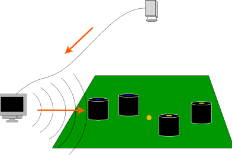

---
# You don't need to edit this file, it's empty on purpose.
# Edit theme's home layout instead if you wanna make some changes
# See: https://jekyllrb.com/docs/themes/#overriding-theme-defaults
layout: home
author_profile: false
classes: wide
---
{: align=right width=30%}

RoboCup Soccer Small Size League は、小型のロボットでサッカーを行う競技です。特に小型リーグでは、非常に動的な環境でのマルチエージェントの協調と制御の問題に焦点を当てています。

フィールド上のロボット・ボールは、約6m上にある複数カメラによって提供されるデータを処理する標準化されたビジョンシステムによって追跡されます。ビジョンシステムは、リーグのコミュニティによって維持されているオープンソースプロジェクトです。

この競技では、多くのハードウェアおよびソフトウェアを巧妙に設計、実装し、堅牢なロボットシステムを構築する必要があります。